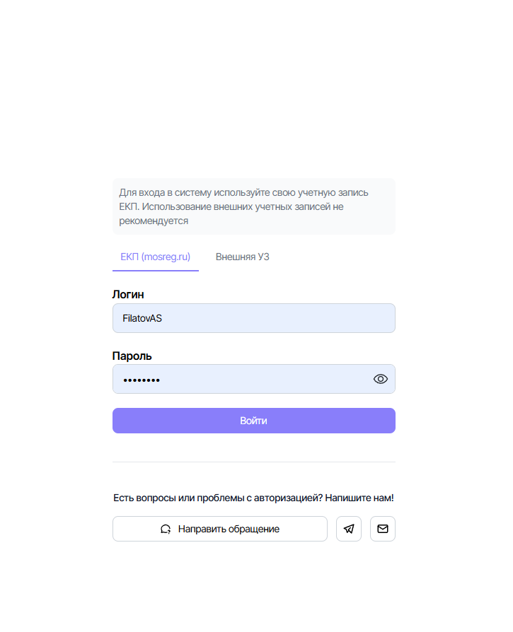

САНКТ-ПЕТЕРБУРГСКИЙ НАЦИОНАЛЬНЫЙ ИССЛЕДОВАТЕЛЬСКИЙ УНИВЕРСИТЕТ ИТМО

Дисциплина: Фронт-энд разработка

Отчет

Лабораторная работа 2. Запросы экранов «Витрины данных»

Выполнил:

Филатор Арсений Сергеевич

Группа K3439

Проверил:
Добряков Д. И.

Санкт-Петербург
2026 г.

## Задача

Подключить экраны лабораторной 1 к внешнему API.

## Ход работы

Вход, списки и карточки идут в REST через `createRestQuery`. Функция собирает query из farfetched: внутри effect, который дергает общий клиент `openapi-fetch`, и контракт на ответ.

```ts
export const createRestQuery = ({ contract, ...config }) => {
  const createdQuery = createQuery({
    effect: createRestRequest(config),
    contract,
  })

  notifyInvalidDataError(createdQuery.finished.failure)

  return withLatestConcurrency(createdQuery)
}
```

В конфиг входят `path`, `method` и `contract`. `request` собирает тело и query из аргументов вызова, `mapResult` приводит JSON к полям экрана. Контракт - схема ответа. Farfetched сверяет с ней данные, и только после этого страница их получает. Если форма ответа не сошлась со схемой, срабатывает `notifyInvalidDataError`.

Клиент уже знает базовый адрес `/api/v1/frontend` и шлет cookie вместе с запросом. В `path` поэтому пишут `/user/login`, а не полный URL. Перед отправкой query чистится: пустые значения выкидываются, `true` и `false` становятся `1` и `0`.

Сам запрос выглядит так.

```ts
const { data, error, response } = await client.request(
  httpMethod ?? method,
  normalizePath(path),
  responseOptions,
)

if (error !== undefined) {
  if (response.status === 401) {
    authSessionInvalidated()
  }

  throw new Error(await formatError(response, error))
}

return mapResult ? mapResult(result) : result
```

Ошибка с сервера превращается в `Error`. Код 401 сбрасывает сессию. Если запрос стартовал повторно, пока предыдущий еще идет, старый отменяется: стратегия `TAKE_LATEST`. Список после смены фильтра не подхватывает устаревший ответ.

Вход. `POST /user/login`, в теле почта, пароль и флаг LDAP.

```ts
export const signInQuery = () =>
  createRestQuery({
    path: '/user/login',
    method: 'post',
    request: (params: SignInParams) => ({
      body: {
        email: params.email,
        password: params.password,
        useLdap: Number(params.useLdap ?? false),
      },
    }),
  })
```

На вкладке ЕКП к логину дописывается `@mosreg.ru`, `useLdap` уходит как `true`. На «Внешней УЗ» почта уходит как введена, `useLdap` равен `false`. Форма с этими полями:



```ts
fn: ({ ldap, email, ...values }) => ({
  email: ldap ? email : `${email}@mosreg.ru`,
  useLdap: !ldap,
  ...values,
})
```

После удачного входа профиль читается отдельным запросом. Кабинет берет из него имя, должность и организацию. Выход закрывает мутация `UserLogout`.

```ts
export const getMeQuery = () =>
  createRestQuery({
    path: '/user',
    method: 'get',
  })

const logoutMutation = graphql(`
  mutation Logout {
    UserLogout
  }
`)
```

Реестр наборов. `GET /dataset`. Поставщик и статус уходят одним значением, избранное включается только на своей вкладке.

```ts
({
  limit: pageSize,
  page,
  isFavorite: tab === 'favorite' ? true : undefined,
  'serviceEntityIds[]': serviceEntityIds.map(String),
  departmentId: departmentIds[0],
  'categoryIds[]': categoryIds.map(String),
  statusId: statusIds[0],
  searchQuery: searchQuery || undefined,
})
```

Поиск. `GET /search`, размер страницы в клиенте зафиксирован.

```ts
export const searchGetQuery = createRestQuery({
  path: '/search',
  method: 'get',
  request: ({ searchQuery, serviceEntityIds, page }) => ({
    params: {
      query: {
        searchQuery,
        limit: 100,
        page,
        'serviceEntityIds[]': serviceEntityIds,
      },
    },
  }),
})
```

Карточка набора и список отчетов.

```ts
export const datasetDetailedQuery = createRestQuery({
  path: '/dataset/{datasetId}',
  method: 'get',
})

export const reportListPaginatedQuery = () =>
  createRestQuery({
    path: '/pattern',
    method: 'get',
  })
```

## Вывод

Вход и профиль ходят на `/user/login` и `/user`, реестр на `GET /dataset` с фильтрами в query, поиск на `GET /search`, список отчетов на `GET /pattern`. Все эти вызовы собраны через `createRestQuery`: `path` и `method` задают маршрут, контракт проверяет ответ, `TAKE_LATEST` отменяет устаревший запрос.
